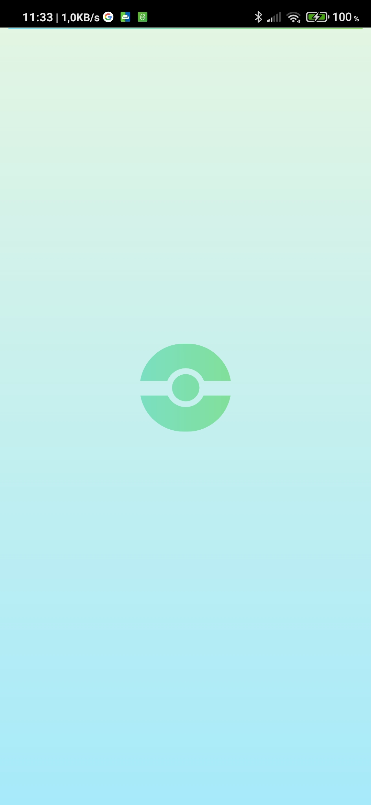
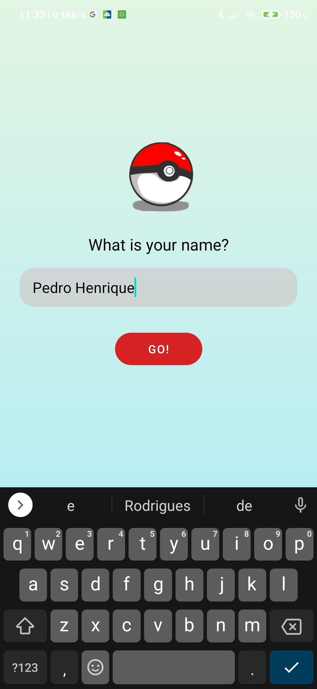
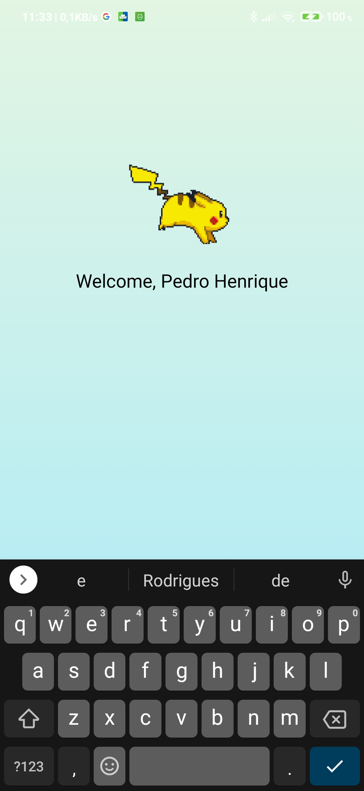
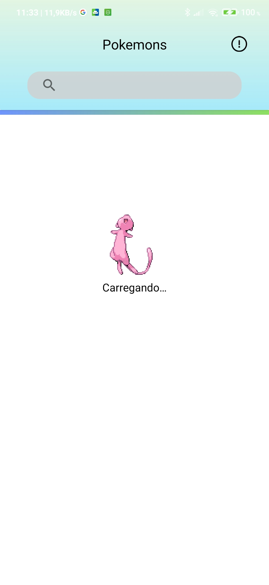
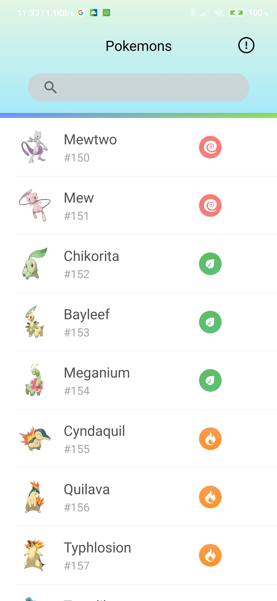
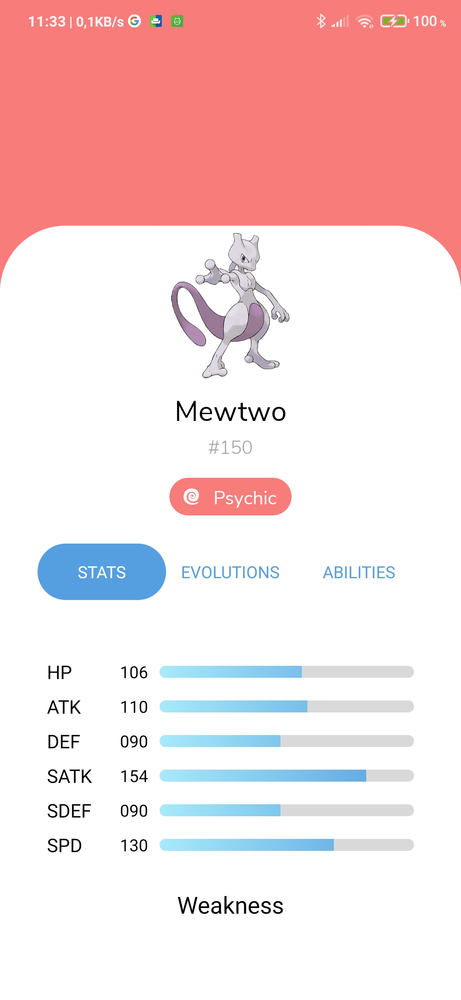

# PokeDex
Projeto integrador desenvolvido durante a primeira edição do AfroDev proposto pela [Sandyara Peres](https://github.com/SandyaraPeres)

## Tecnologias:

- [Kotlin](https://kotlinlang.org/)
- [Android Studio](https://developer.android.com/studio?gclid=CjwKCAiAnIT9BRAmEiwANaoE1cY5mFEvwH8XLSrBrTUetEslndCqZCKuJVq5ubCY7w3Q-V5ipcBRHhoCs9gQAvD_BwE&gclsrc=aw.ds)
- [PokeApi/PokeKotlin](https://pokeapi.co/docs/v2)

## Conhecimentos aplicados
- [Activity Lifecycle](https://developer.android.com/guide/components/activities/activity-lifecycle?hl=pt-br)
- [RecyclerView](https://developer.android.com/guide/topics/ui/layout/recyclerview?hl=pt-br)
- [Fragments](https://developer.android.com/guide/components/fragments?hl=pt-br)
- [Coroutines](https://developer.android.com/kotlin/coroutines)

## Telas

## Splash Screen
 
## Welcome Screen

## Loading Screen

## Loading Pokemon List

## Loading Pokemon List

## Pokemon List

## Pokemon Details

